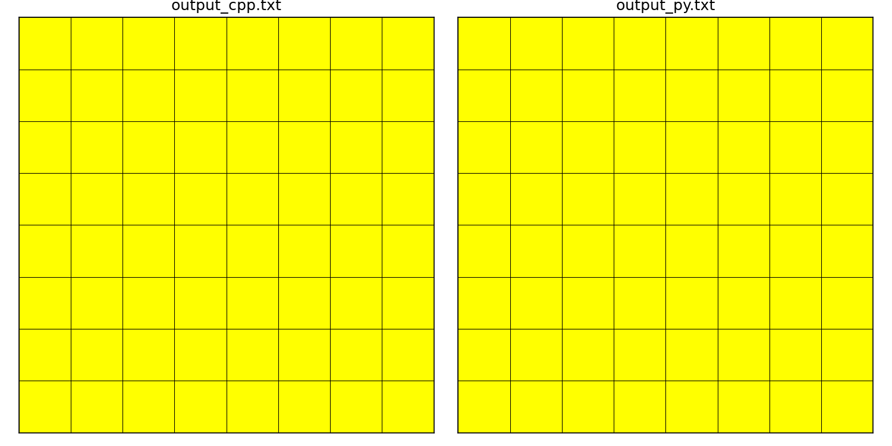
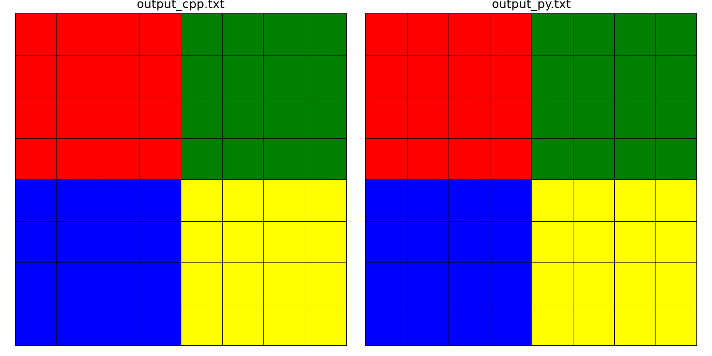
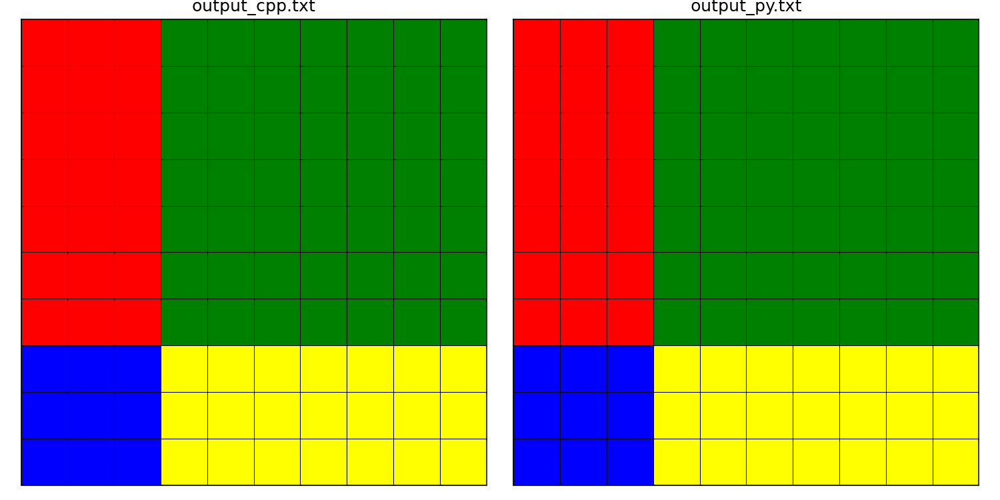

# Task 4 - Matrix Slicing

The slicing code was implemented in C++ and in Python using NumPy. To run the Python code, run `python3` directly on `slicing.py`. Make sure you have `numpy` installed.

For the C++ code, you can run the following if you have `make` installed:

```
make slicing
```

The C++ and Python scripts read the matrix from `input.txt` and slice this matrix according to the parameters specified by you in the console when you run them. You can modify `input.txt` if you want, but make sure you use only integers 1-4 inside the matrix (these represent the colors in the visualization). The scripts then output the results to `output_cpp.txt` and `output_py.txt` for C++ and Python, respectively.

There is also the `visualize.py` script that draws a nice image that shows the matrix as a gridded image. The script saves the resulting image to `output.png`. Before running, make sure you have matplotlib installed. This script was written with AI help (see below).

## Visualization

Parameters have the format: `row_start row_end col_start col_end`.

### Full image

Parameters: `0 16 0 16`

Output:


### Third quarter

Parameters: `8 16 8 16`

Output:



### Middle

Parameters: `4 12 4 12`



### Random parameters

Parameters: `1 11 5 15`



## AI Usage

I wrote the matplotlib code in `visualize.py` with help from AI. I think this code is just a nicety and was not very important to the task. Also, writing beautiful matplotlib code manually requires a lot of practice. Unfortunately, I don't have that.

# ChatGPT Solution

The ChatGPT solution can be found in `chatgpt/`.

Its solution is more advanced, because it utilizes CSV files for input/output and it also implements slicing step. The visualization is very detailed, clearly showing which elements were pulled from the matrix. The C++ implementation is also more robust because it uses exceptions.

However, the slice parameters are hardcoded and cannot be configured from the CLI, unlike my solution.

Full details are described in `chatgpt/README.md`.

As in Task 3, I didn't change much in the task statement. I sent it as is, only adding the instructions to store all code in `code/` and show the images and other information in `README.md`.
