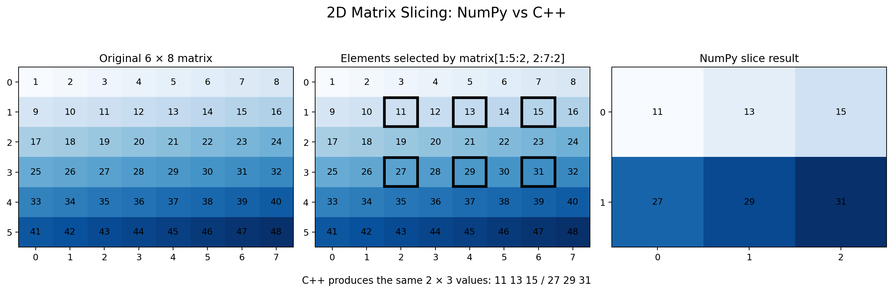

# 2D Matrix Slicing — NumPy and C++

This project demonstrates equivalent **2D matrix slicing** in NumPy and C++ and visually compares the result.

## Slice being implemented

Both implementations start with the same `6 × 8` matrix containing the integers `1` through `48`:

```text
 1  2  3  4  5  6  7  8
 9 10 11 12 13 14 15 16
17 18 19 20 21 22 23 24
25 26 27 28 29 30 31 32
33 34 35 36 37 38 39 40
41 42 43 44 45 46 47 48
```

The NumPy slice is:

```python
matrix[1:5:2, 2:7:2]
```

This means:

- rows: start at index `1`, stop before `5`, step by `2` → rows `1, 3`
- columns: start at index `2`, stop before `7`, step by `2` → columns `2, 4, 6`

Therefore both implementations should produce:

```text
11 13 15
27 29 31
```

## Graphical result

The image below shows the original matrix, highlights the elements selected by the slice, and displays the resulting NumPy matrix. The C++ result is compared programmatically against the same result.



## Implementation

### NumPy

`code/numpy_slicing.py` uses NumPy's native 2D slicing syntax:

```python
sliced = matrix[1:5:2, 2:7:2]
```

### C++

`code/cpp_slicing.cpp` implements the same semantics using nested loops. The parameters correspond directly to the NumPy slice:

```text
rows:    1, 5, 2
columns: 2, 7, 2
```

The C++ implementation writes its result to `code/cpp_slice.csv`.

## Verification

`code/compare.py`:

1. compiles the C++ implementation with `g++`;
2. runs the C++ implementation;
3. runs the NumPy implementation;
4. reads both CSV results;
5. compares the matrices element-by-element; and
6. exits with an error if the results differ.

A successful run ends with:

```text
Comparison
NumPy: [[11, 13, 15], [27, 29, 31]]
C++:   [[11, 13, 15], [27, 29, 31]]
MATCH: True
```

## Project structure

```text
.
├── README.md
├── images/
│   └── slicing_comparison.png
└── code/
    ├── cpp_slicing.cpp
    ├── compare.py
    ├── numpy_slicing.py
    ├── requirements.txt
    └── run.sh
```

All implementation source code is contained in the `code/` directory, while the README and graphical result are available at the top level of the project.

## How to run

Install the Python dependencies:

```bash
python3 -m pip install -r code/requirements.txt
```

Then run:

```bash
./code/run.sh
```

The script automatically compiles the C++ program and verifies that its output matches the NumPy result.
